<center>
<p align="center">


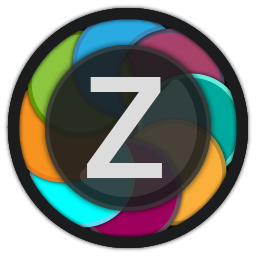

<h1>Zenburn In Grays Theme</h1> 
<h4>Theme with Zenburn TokenColors on Dark Backgrounds (Cold / Deep Sea / EclipseDS / Flat / Insomnia / Low Blue / Midnight / Nadir / Nirvana / Warm).</h4>


[](https://marketplace.visualstudio.com/items?itemName=nicola-granata.zenburn-in-grays)&nbsp;[](https://marketplace.visualstudio.com/items?itemName=nicola-granata.zenburn-in-grays)&nbsp;[](https://marketplace.visualstudio.com/items?itemName=nicola-granata.zenburn-in-grays)&nbsp;[](https://marketplace.visualstudio.com/items?itemName=nicola-granata.zenburn-in-grays)&nbsp;

</p>
</center>


# Table of contents
1. [Zenburn token colors based skins](#zenburn-token-colors-based-skins)
1. [Fonts for Zenburn In Grays](#fonts-for-zenburn-in-grays)
1. [What's new in Zenburn In Grays](#whats-new-in-zenburn-in-grays)
	- [Ver. 1.1.105](#ver-11105)
	- [Ver. 1.1.102](#ver-11102)
	- [Ver. 1.1.101](#ver-11101)
1. [Zenburn In Grays previews](#zenburn-in-grays-previews)
	- [Zenburn In Grays variants descriptions](#zenburn-in-grays-variants-descriptions)
	- [Zenburn In Grays skins gallery](#zenburn-in-grays-skins-gallery)
		- [Cold](#cold)
		- [Deep Sea](#deep-sea)
		- [EclipseDS](#eclipseds)
		- [Flat](#flat)
		- [Insomnia](#insomnia)
		- [Low Blue](#low-blue)
		- [Midnight](#midnight)
		- [Nadir](#nadir)
		- [Nirvana](#nirvana)
		- [Warm](#warm)
1. [All my Themes](#all-my-themes)
1. [About Themes](#about-themes)
	- [Zenburn Themes](#zenburn-themes)
1. [About my PHP Script "VSCode Themes Master"](#about-my-php-script-vscode-themes-master)
1. [Gratitude](#gratitude)
	- [Zenburn Token Colors based Themes](#zenburn-token-colors-based-themes)
1. [License](#license)


<!--
//# Zenburn In Grays Theme 
-->

# Zenburn token colors based skins
<div align="right">[ <a align="right" href="#table-of-contents">Table of contents</a> ]</div>


All the skins shown below are part of a suite designed to try to reduce visual fatigue while using `Visual Studio Code`.

The ultimate goal of the suite is to offer a good chance to find a theme that reduces disturbing elements and eye strain as much as possible.

However, attempts were made to leave error signals and selections clearly visible with moderate color contrasts.

> Tip 1: The skins are quite similar but you can find the right color intensity based on the `sRGB` representation of your monitor and the sensitivity of your eyes to certain frequencies.

> Tip 2: If you like versioning your code, try [**Version Boss**](https://marketplace.visualstudio.com/items?itemName=nicola-granata.version-boss)! `Version Boss` is a free extension that `simplifies versioning of script files`. Download it at [Marketplace](https://marketplace.visualstudio.com/items?itemName=nicola-granata.version-boss).

# Fonts for Zenburn In Grays
<div align="right">[ <a align="right" href="#table-of-contents">Table of contents</a> ]</div>


The settings for the following fonts are correctly tested on a 24" monitor FullHD and 32" Monitor QHD. The indicated sizes are the minimum to obtain a clear display of the fonts.


> Tip 1: Some fonts `Weight` property start from `300`/`400`/`500`: values below these values has no effect. Others, instead, start from `100` but can be thiny and unreadable below size `12`.

> Tip 2: Some fonts have some variations of the same file (e.g. version with different line-height or letter "k" with no loop): when you install, the previous font file will be overwritten. 

> Tip 3: `Rating` is based on my personal edperience and taste. The evaluation method is based on the readability of the font to the size of `10` points or to the size of `12` points if, the latter, correspond to the size of `10` points of other fonts present in the selection.
So the fonts with rating `5` have these characteristics, the other evaluations indicate that the font is readable at a size greater than `10` but that they occupy more space and, consequently I will have fewer rows and columns per screen.
Those of you with vision problems should simply ignore my assessment, because the fonts listed are all valid.


| Font | Size | Weight | Line Height | Letter Spacing | Ligatures | Rating | Download  |
|---|:---:|:---:|:---:|:---:|:---:|:---:|--- |
| Envy Code R | 12 | 500 | 16 | 0 |  - | 5 | [Download](https://damieng.com/blog/2008/05/26/envy-code-r-preview-7-coding-font-released)  |
| Fantasque Sans Mono | 12 | 500 | 16 | 0 | 1 | 4 | [Download](https://github.com/belluzj/fantasque-sans/releases)  |
| Fira Mono | 10 | 400 | 14 | 0 |  - | 4 | [Download](https://rubjo.github.io/victor-mono)  |
| FiraFlott | 10 | 400 | 14 | 0 | 1 | 4 | [Download](https://github.com/kosimst/FiraFlott)  |
| Hack | 10 | 500 | 14 | 0 |  - | 5 | [Download](https://sourcefoundry.org/hack)  |
| Inconsolata | 12 | 400 | 16 | 0 |  - | 4 | [Download](https://fonts.google.com/specimen/Inconsolata)  |
| Input Mono | 11 | 300 | 15 | 0 |  - | 4 | [Download](https://input.fontbureau.com/download)  |
| Input Mono Condensed | 11 | 300 | 15 | 0 |  - | 4 | [Download](https://input.fontbureau.com/download)  |
| Iosevka | 13 | 300 | 16 | 0 | 1 | 4 | [Download](https://typeof.net/Iosevka)  |
| PT Mono | 11 | 500 | 16 | 0 |  - | 4 | [Download](https://fonts.google.com/specimen/PT+Mono?selection.family=PT+Mono)  |
| Source Code Pro | 12 | 400 | 16 | 0 |  - | 3 | [Download](https://fonts.google.com/specimen/Source+Code+Pro)  |
| Victor Mono | 12 | 400 | 16 | 0.1 | 1 | 4 | [Download](https://rubjo.github.io/victor-mono)  |


 ```json 
 // Some fonts need to be right set to be clearly legible:
 // please, adjust these settings in "settings.json".
 // --
 // Note 1: "editor.fontLigatures" can be ever "true";
 // Note 2: "editor.fontWeight" value must be written 
 //         in quotation marks (e.g. "400") even if it is a numeric value!

  "editor.fontSize": 10,
  "editor.lineHeight": 14,
  "editor.letterSpacing": 0,
  "editor.fontWeight": "400",
  "editor.fontLigatures": true,
  "editor.fontFamily": "Hack, Victor Mono, Fira Mono, monotype",

 ```

# What's new in Zenburn In Grays
<div align="right">[ <a align="right" href="#table-of-contents">Table of contents</a> ]</div>


> Note: [`Development`] and [`UI Manager`] sections in *Changelog* are addressed to the developer to remind him of any important changes that occurred during the writing of the code and do not always concern improvements made to the extension or to the theme.

## Ver. 1.1.105
<div align="right">[ <a align="right" href="#table-of-contents">Table of contents</a> ]</div>

- [`Themes`] Removed `fontStyle`: `bold` from tokencolors: this make code more readable at low font size;
- [`Readme`] Added `Table of Contents`; 
- [`Readme`] Added some informations about fonts rating; 
- [`Development`] Fixed a bug in load and manage JSON export from Visual Studio Code. Added a code to remove special PHP symbols from JSON that can be recognized as "active code" by `VSCode Themes Master`;
- [`Development`] Added options to remove `fontStyle` => `bold`/`underline`/`italic` form Token Colors (`tokenColorsOptions` can be different for for each sub-theme); 
- [`Development`] Implemented function to make hierarchical `Table of Contents`; 
- [`Development`] Rewritten function to make `Themes Gallery` to solve a bug with table generation; 
- [`Development`] Implemented function to manage suggested fonts for coding.

## Ver. 1.1.102
<div align="right">[ <a align="right" href="#table-of-contents">Table of contents</a> ]</div>

- [`Themes`] Added `Insomnia` sub-theme, clone of Nadir, with flatten colors, low UI contrast, and ultra-satured token colors: although this skin is the opposite concept to the others, in conditions of excessive brightness of the room, it may be convenient to have a theme with greater contrasts;
- [`Readme`] Added sample color previews of UI (1st row) and Token Colors (2nd row) to UI previews;
- [`Readme`] The organization of the previews is more orderly;
- [`Readme`] Added font suggestion section;
- [`UI Manager`] Improved `Token colors Inspector`: now, if opacity is present, shows the same color in two swatches: with and without opacity;
- [`Development`] Implemented function to manage colors using HSL/HSV and improved some ColorMath functions;

## Ver. 1.1.101
<div align="right">[ <a align="right" href="#table-of-contents">Table of contents</a> ]</div>

- [`Themes`] Added `Deep Sea` sub-theme, with extra deep blue background, flatten colors, low UI contrast, and ultra-desatured token colors;
- [`Themes`] Added `Nadir` sub-theme, with extra cold gray background, flatten colors, low UI contrast, and ultra-desatured token colors;
- [`Themes`] Change `Open a remote window` button colors (background and foreground);
- [`Themes`] Added/Changed some skin main colors;
- [`Development`] Some improvements to the README.md output;
- [`Development`] The assignment of some relative colors has been revised;
- [`Development`] Added selection menu to go to UI preview on the page and on page reload, to better recognize the impact of the changes applied to the skin;
- [`Development`] Improved function for UI colors override: now is possible to override main colors and apply transformations o apply only transformations without override;
- [`Development`] Addedd lastest 3 (but number si customizable) changelogs to README.md.


See `Changelog` for previous versions.

# Zenburn In Grays previews
<div align="right">[ <a align="right" href="#table-of-contents">Table of contents</a> ]</div>

<!--
`Note`: This demo not contains all subset of variants, because the representation of color in GIF format is not completely faithful.

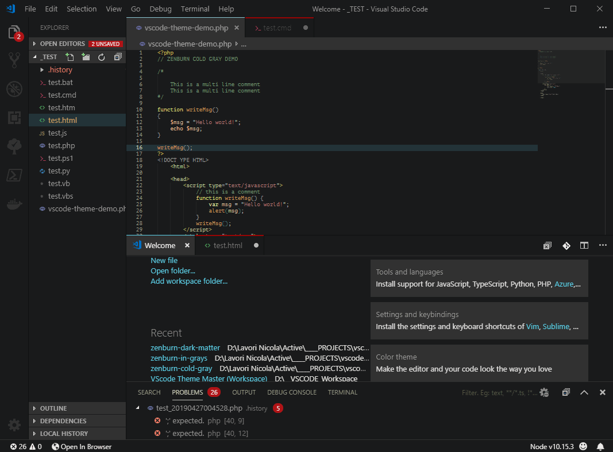
-->

## Zenburn In Grays variants descriptions
<div align="right">[ <a align="right" href="#table-of-contents">Table of contents</a> ]</div>


| Variant | Description |
|--- |--- |
|`Cold`|Cold Gray Background and Cold Token Colors|
|`Deep Sea`|Deep blue flat UI and Desatured Token Colors|
|`EclipseDS`|Eclipse DevStyle Gray Background and Desatured Token Colors|
|`Flat`|Flat Gray Background and Default Token Colos|
|`Insomnia`|Flat Grayed UI and Super-satured Token Colors|
|`Low Blue`|Low Blue Light on UI and Token Colors|
|`Midnight`|Midnight Blue Background, inspired by *Telegram X Midnight Theme* and Cold, Desatured Token Colors|
|`Nadir`|Flat Grayed UI and Desatured Token Colors|
|`Nirvana`|Low Blue Light only on Token Colors|
|`Warm`|Warm Gray Background and Warm Token Colors|

<!-- 
// ## Zenburn In Grays Skins list:

- `Zenburn In Grays - Cold - Asphalt`;
- `Zenburn In Grays - Cold - Eggplant`;
- `Zenburn In Grays - Cold - Lazy`;
- `Zenburn In Grays - Cold - Sugar Paper`;
- `Zenburn In Grays - Deep Sea - Asphalt`;
- `Zenburn In Grays - Deep Sea - Eggplant`;
- `Zenburn In Grays - Deep Sea - Lazy`;
- `Zenburn In Grays - Deep Sea - Sugar Paper`;
- `Zenburn In Grays - EclipseDS - Asphalt`;
- `Zenburn In Grays - EclipseDS - Eggplant`;
- `Zenburn In Grays - EclipseDS - Lazy`;
- `Zenburn In Grays - EclipseDS - Sugar Paper`;
- `Zenburn In Grays - Flat - Asphalt`;
- `Zenburn In Grays - Flat - Eggplant`;
- `Zenburn In Grays - Flat - Lazy`;
- `Zenburn In Grays - Flat - Sugar Paper`;
- `Zenburn In Grays - Insomnia - Asphalt`;
- `Zenburn In Grays - Insomnia - Eggplant`;
- `Zenburn In Grays - Insomnia - Lazy`;
- `Zenburn In Grays - Insomnia - Sugar Paper`;
- `Zenburn In Grays - Low Blue - Asphalt`;
- `Zenburn In Grays - Low Blue - Lazy`;
- `Zenburn In Grays - Midnight - Sugar Paper`;
- `Zenburn In Grays - Nadir - Asphalt`;
- `Zenburn In Grays - Nadir - Eggplant`;
- `Zenburn In Grays - Nadir - Lazy`;
- `Zenburn In Grays - Nadir - Sugar Paper`;
- `Zenburn In Grays - Nirvana - Asphalt`;
- `Zenburn In Grays - Nirvana - Eggplant`;
- `Zenburn In Grays - Nirvana - Lazy`;
- `Zenburn In Grays - Nirvana - Sugar Paper`;
- `Zenburn In Grays - Warm - Asphalt`;
- `Zenburn In Grays - Warm - Eggplant`;
- `Zenburn In Grays - Warm - Lazy`;
- `Zenburn In Grays - Warm - Sugar Paper`.

-->

## Zenburn In Grays skins gallery
<div align="right">[ <a align="right" href="#table-of-contents">Table of contents</a> ]</div>


### Cold
<div align="right">[ <a align="right" href="#table-of-contents">Table of contents</a> ]</div>

<b>4 skins</b> - Cold Gray Background and Cold Token Colors

<table><tr><td> <a href="./_gfx/zenburn-in-grays-cold-asphalt-preview.png" title="Go to Zenburn In Grays - Cold - Asphalt">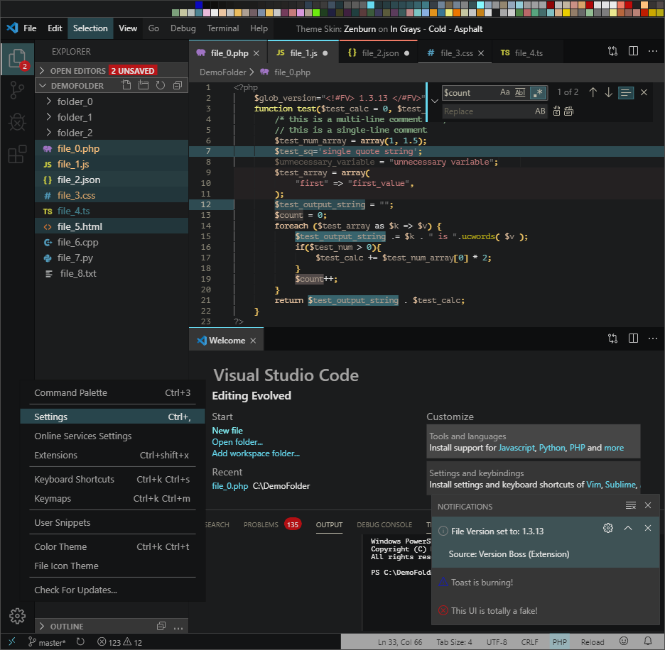</a>
</td><td> <a href="./_gfx/zenburn-in-grays-cold-eggplant-preview.png" title="Go to Zenburn In Grays - Cold - Eggplant">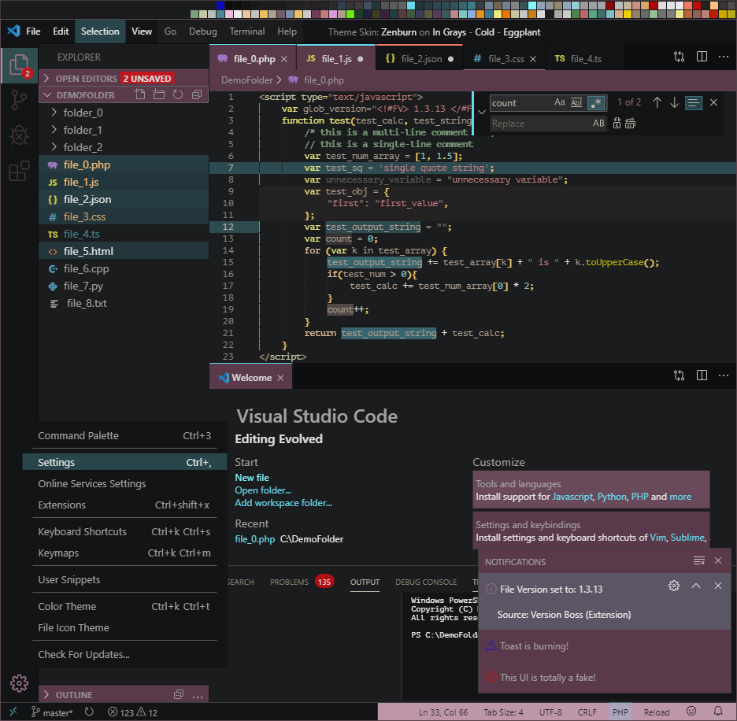</a>
</td><td> <a href="./_gfx/zenburn-in-grays-cold-lazy-preview.png" title="Go to Zenburn In Grays - Cold - Lazy">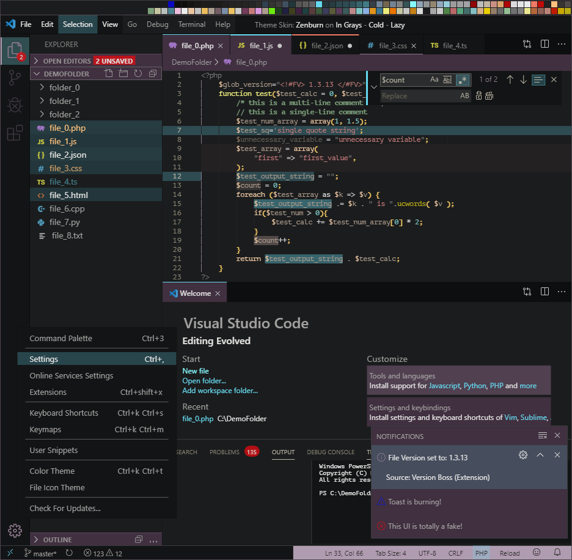</a>
</td></tr>
<tr><td><b>1</b> / <b>35</b> - <a href="./_gfx/zenburn-in-grays-cold-asphalt-preview.png"  title="Go to Zenburn In Grays - Cold - Asphalt">Zenburn In Grays - Cold - Asphalt</a> 
</td><td><b>2</b> / <b>35</b> - <a href="./_gfx/zenburn-in-grays-cold-eggplant-preview.png"  title="Go to Zenburn In Grays - Cold - Eggplant">Zenburn In Grays - Cold - Eggplant</a> 
</td><td><b>3</b> / <b>35</b> - <a href="./_gfx/zenburn-in-grays-cold-lazy-preview.png"  title="Go to Zenburn In Grays - Cold - Lazy">Zenburn In Grays - Cold - Lazy</a> 
</td></tr>
<tr><td> <a href="./_gfx/zenburn-in-grays-cold-sugar-paper-preview.png" title="Go to Zenburn In Grays - Cold - Sugar Paper">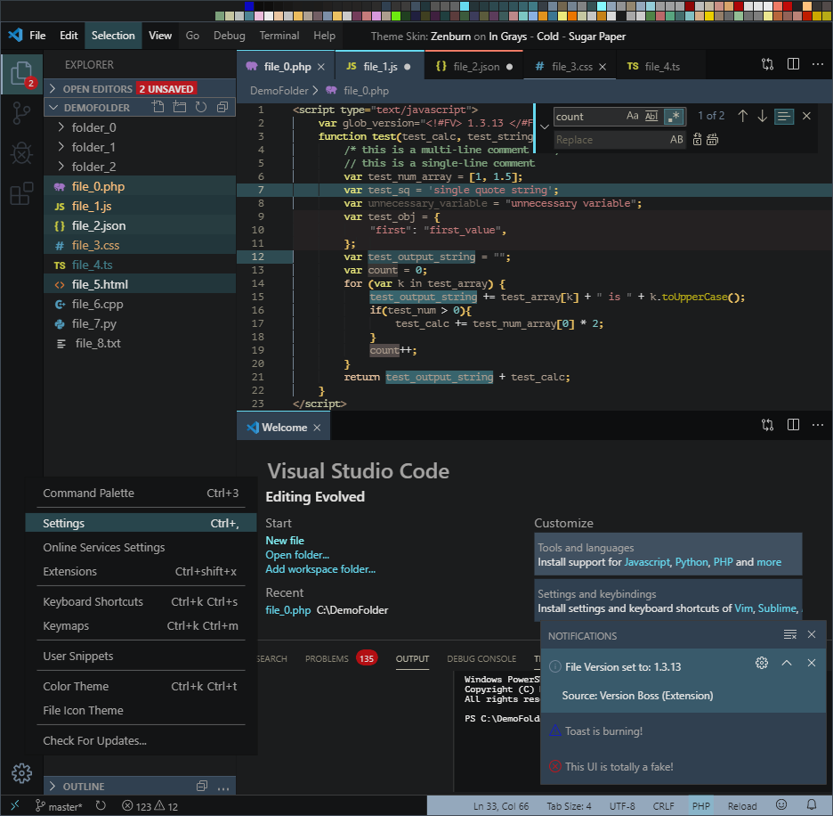</a>
</td><td colspan="2" rowspan="2" width="66%"></td></tr>
<tr><td><b>4</b> / <b>35</b> - <a href="./_gfx/zenburn-in-grays-cold-sugar-paper-preview.png"  title="Go to Zenburn In Grays - Cold - Sugar Paper">Zenburn In Grays - Cold - Sugar Paper</a> 
</td></tr>
</table>


### Deep Sea
<div align="right">[ <a align="right" href="#table-of-contents">Table of contents</a> ]</div>

<b>4 skins</b> - Deep blue flat UI and Desatured Token Colors

<table><tr><td> <a href="./_gfx/zenburn-in-grays-deepsea-asphalt-preview.png" title="Go to Zenburn In Grays - Deep Sea - Asphalt">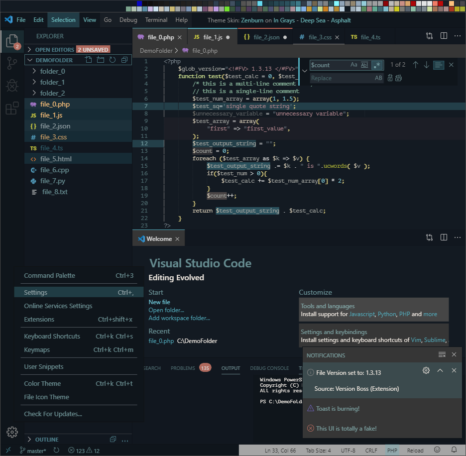</a>
</td><td> <a href="./_gfx/zenburn-in-grays-deepsea-eggplant-preview.png" title="Go to Zenburn In Grays - Deep Sea - Eggplant">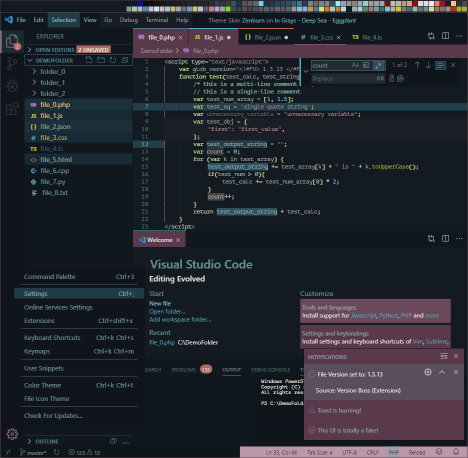</a>
</td><td> <a href="./_gfx/zenburn-in-grays-deepsea-lazy-preview.png" title="Go to Zenburn In Grays - Deep Sea - Lazy">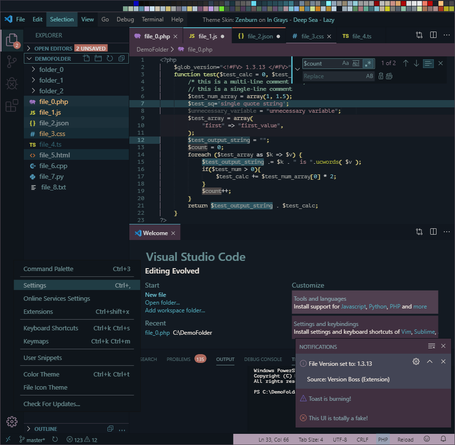</a>
</td></tr>
<tr><td><b>5</b> / <b>35</b> - <a href="./_gfx/zenburn-in-grays-deepsea-asphalt-preview.png"  title="Go to Zenburn In Grays - Deep Sea - Asphalt">Zenburn In Grays - Deep Sea - Asphalt</a> 
</td><td><b>6</b> / <b>35</b> - <a href="./_gfx/zenburn-in-grays-deepsea-eggplant-preview.png"  title="Go to Zenburn In Grays - Deep Sea - Eggplant">Zenburn In Grays - Deep Sea - Eggplant</a> 
</td><td><b>7</b> / <b>35</b> - <a href="./_gfx/zenburn-in-grays-deepsea-lazy-preview.png"  title="Go to Zenburn In Grays - Deep Sea - Lazy">Zenburn In Grays - Deep Sea - Lazy</a> 
</td></tr>
<tr><td> <a href="./_gfx/zenburn-in-grays-deepsea-sugar-paper-preview.png" title="Go to Zenburn In Grays - Deep Sea - Sugar Paper">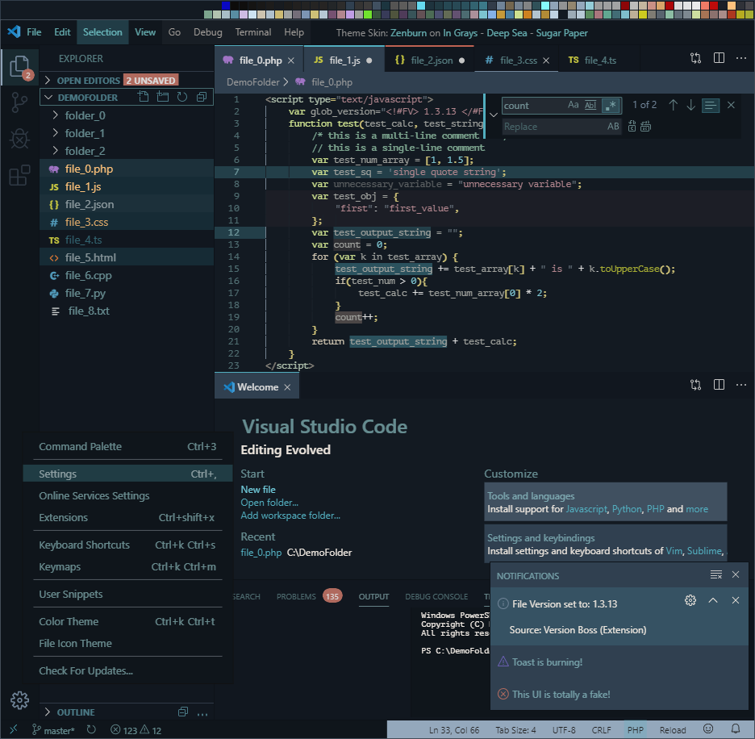</a>
</td><td colspan="2" rowspan="2" width="66%"></td></tr>
<tr><td><b>8</b> / <b>35</b> - <a href="./_gfx/zenburn-in-grays-deepsea-sugar-paper-preview.png"  title="Go to Zenburn In Grays - Deep Sea - Sugar Paper">Zenburn In Grays - Deep Sea - Sugar Paper</a> 
</td></tr>
</table>


### EclipseDS
<div align="right">[ <a align="right" href="#table-of-contents">Table of contents</a> ]</div>

<b>4 skins</b> - Eclipse DevStyle Gray Background and Desatured Token Colors

<table><tr><td> <a href="./_gfx/zenburn-in-grays-eclipseds-asphalt-preview.png" title="Go to Zenburn In Grays - EclipseDS - Asphalt">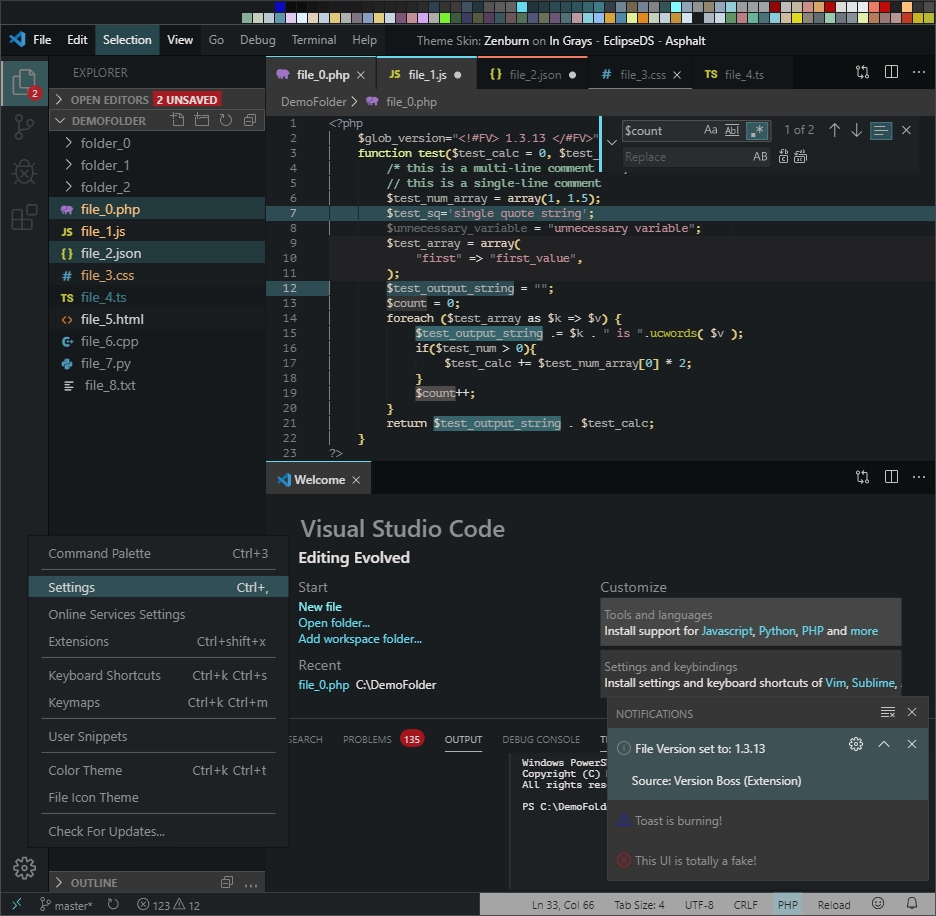</a>
</td><td> <a href="./_gfx/zenburn-in-grays-eclipseds-eggplant-preview.png" title="Go to Zenburn In Grays - EclipseDS - Eggplant">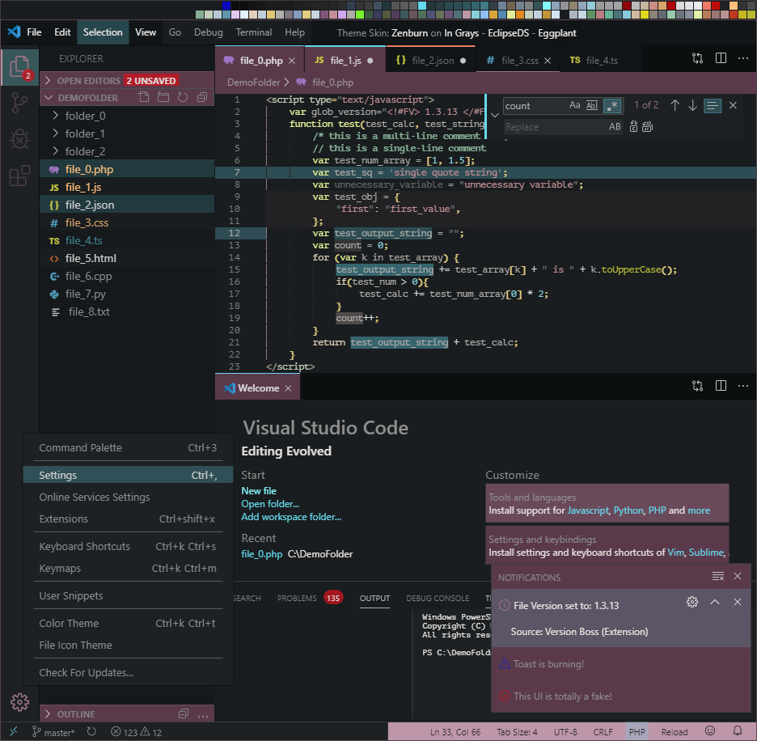</a>
</td><td> <a href="./_gfx/zenburn-in-grays-eclipseds-lazy-preview.png" title="Go to Zenburn In Grays - EclipseDS - Lazy">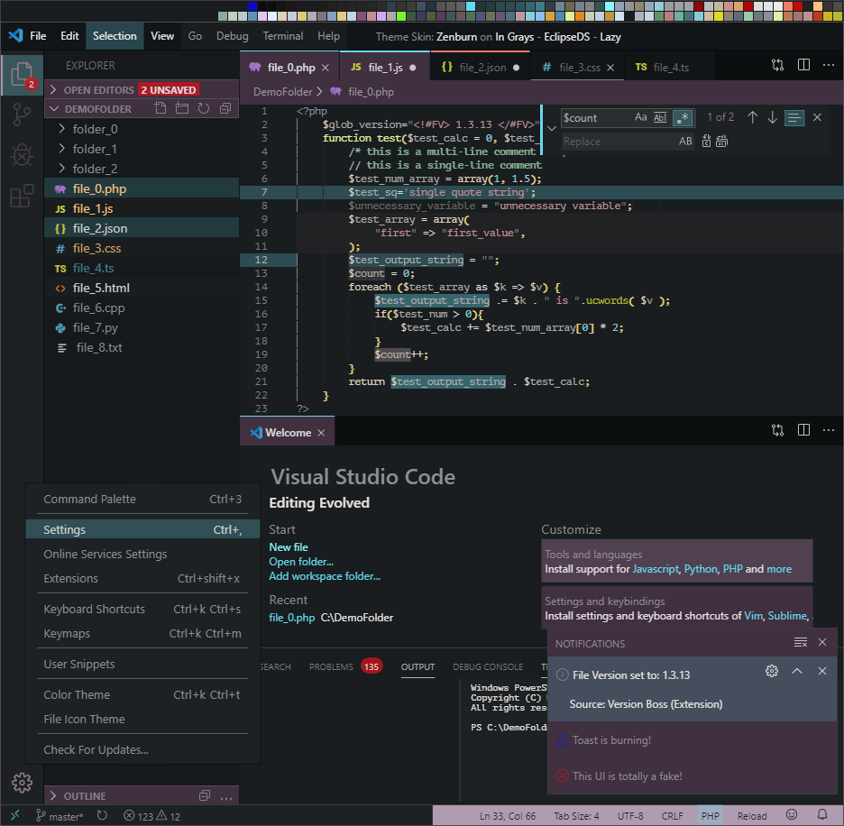</a>
</td></tr>
<tr><td><b>9</b> / <b>35</b> - <a href="./_gfx/zenburn-in-grays-eclipseds-asphalt-preview.png"  title="Go to Zenburn In Grays - EclipseDS - Asphalt">Zenburn In Grays - EclipseDS - Asphalt</a> 
</td><td><b>10</b> / <b>35</b> - <a href="./_gfx/zenburn-in-grays-eclipseds-eggplant-preview.png"  title="Go to Zenburn In Grays - EclipseDS - Eggplant">Zenburn In Grays - EclipseDS - Eggplant</a> 
</td><td><b>11</b> / <b>35</b> - <a href="./_gfx/zenburn-in-grays-eclipseds-lazy-preview.png"  title="Go to Zenburn In Grays - EclipseDS - Lazy">Zenburn In Grays - EclipseDS - Lazy</a> 
</td></tr>
<tr><td> <a href="./_gfx/zenburn-in-grays-eclipseds-sugar-paper-preview.png" title="Go to Zenburn In Grays - EclipseDS - Sugar Paper">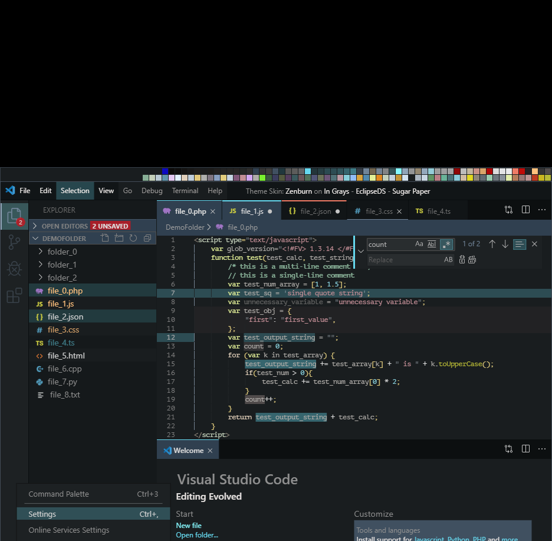</a>
</td><td colspan="2" rowspan="2" width="66%"></td></tr>
<tr><td><b>12</b> / <b>35</b> - <a href="./_gfx/zenburn-in-grays-eclipseds-sugar-paper-preview.png"  title="Go to Zenburn In Grays - EclipseDS - Sugar Paper">Zenburn In Grays - EclipseDS - Sugar Paper</a> 
</td></tr>
</table>


### Flat
<div align="right">[ <a align="right" href="#table-of-contents">Table of contents</a> ]</div>

<b>4 skins</b> - Flat Gray Background and Default Token Colos

<table><tr><td> <a href="./_gfx/zenburn-in-grays-flat-asphalt-preview.png" title="Go to Zenburn In Grays - Flat - Asphalt">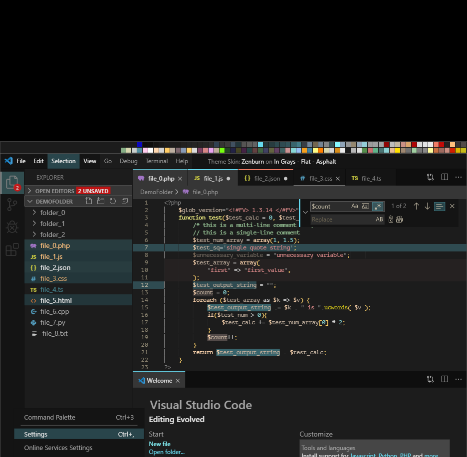</a>
</td><td> <a href="./_gfx/zenburn-in-grays-flat-eggplant-preview.png" title="Go to Zenburn In Grays - Flat - Eggplant">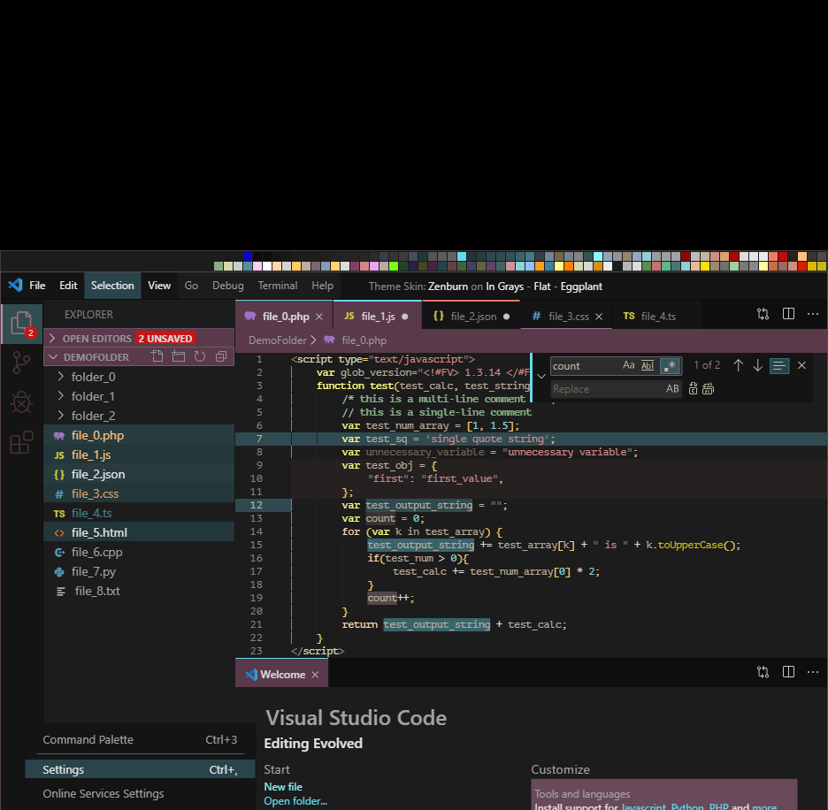</a>
</td><td> <a href="./_gfx/zenburn-in-grays-flat-lazy-preview.png" title="Go to Zenburn In Grays - Flat - Lazy">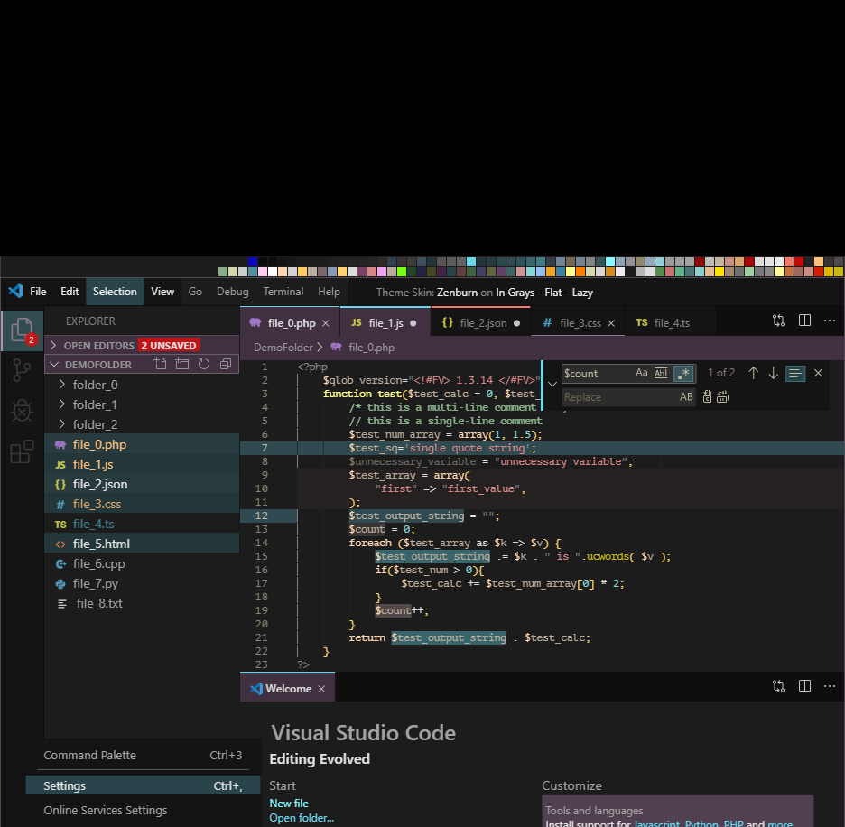</a>
</td></tr>
<tr><td><b>13</b> / <b>35</b> - <a href="./_gfx/zenburn-in-grays-flat-asphalt-preview.png"  title="Go to Zenburn In Grays - Flat - Asphalt">Zenburn In Grays - Flat - Asphalt</a> 
</td><td><b>14</b> / <b>35</b> - <a href="./_gfx/zenburn-in-grays-flat-eggplant-preview.png"  title="Go to Zenburn In Grays - Flat - Eggplant">Zenburn In Grays - Flat - Eggplant</a> 
</td><td><b>15</b> / <b>35</b> - <a href="./_gfx/zenburn-in-grays-flat-lazy-preview.png"  title="Go to Zenburn In Grays - Flat - Lazy">Zenburn In Grays - Flat - Lazy</a> 
</td></tr>
<tr><td> <a href="./_gfx/zenburn-in-grays-flat-sugar-paper-preview.png" title="Go to Zenburn In Grays - Flat - Sugar Paper">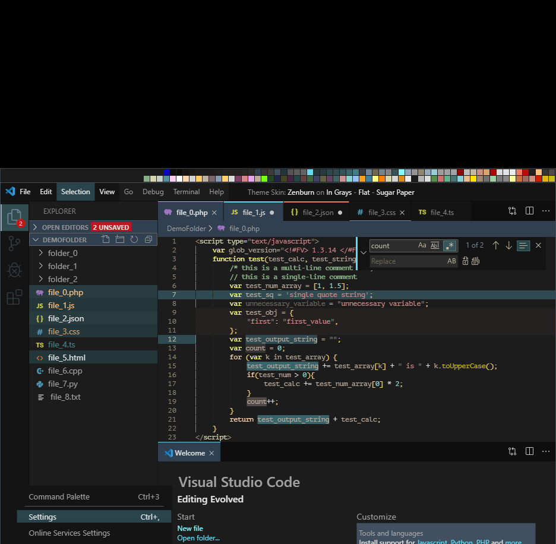</a>
</td><td colspan="2" rowspan="2" width="66%"></td></tr>
<tr><td><b>16</b> / <b>35</b> - <a href="./_gfx/zenburn-in-grays-flat-sugar-paper-preview.png"  title="Go to Zenburn In Grays - Flat - Sugar Paper">Zenburn In Grays - Flat - Sugar Paper</a> 
</td></tr>
</table>


### Insomnia
<div align="right">[ <a align="right" href="#table-of-contents">Table of contents</a> ]</div>

<b>4 skins</b> - Flat Grayed UI and Super-satured Token Colors

<table><tr><td> <a href="./_gfx/zenburn-in-grays-insomnia-asphalt-preview.png" title="Go to Zenburn In Grays - Insomnia - Asphalt">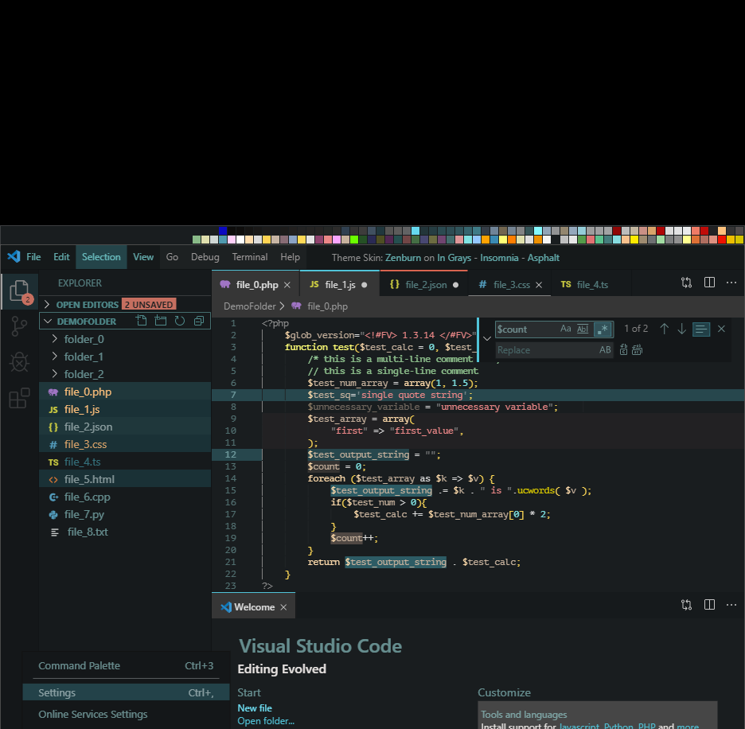</a>
</td><td> <a href="./_gfx/zenburn-in-grays-insomnia-eggplant-preview.png" title="Go to Zenburn In Grays - Insomnia - Eggplant">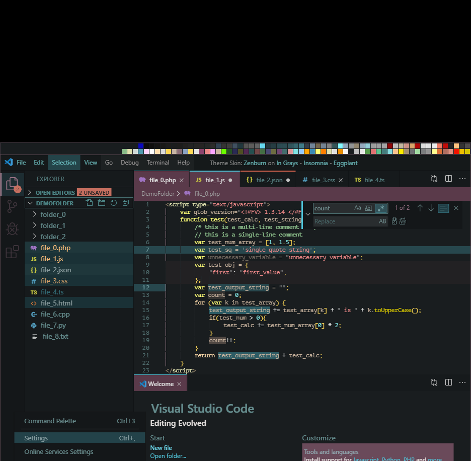</a>
</td><td> <a href="./_gfx/zenburn-in-grays-insomnia-lazy-preview.png" title="Go to Zenburn In Grays - Insomnia - Lazy">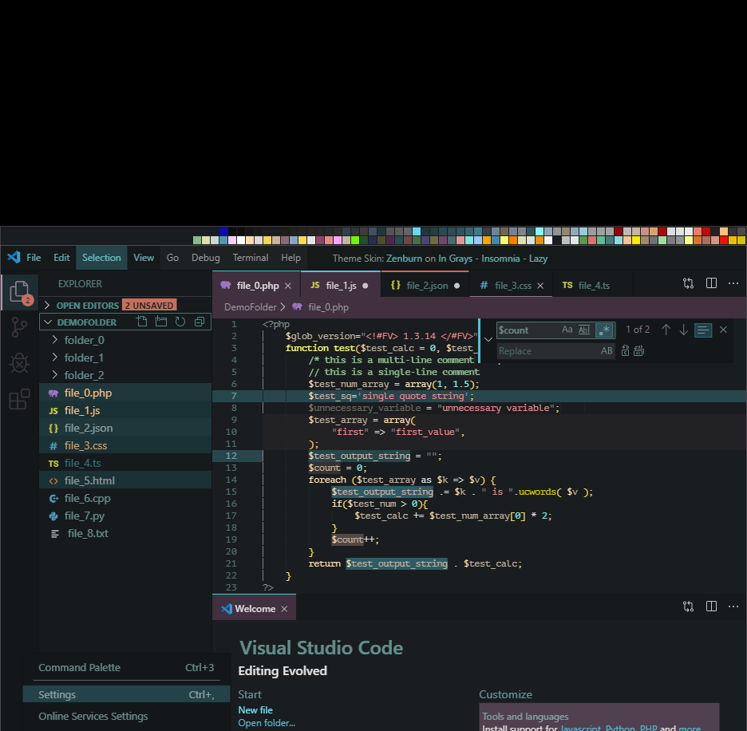</a>
</td></tr>
<tr><td><b>17</b> / <b>35</b> - <a href="./_gfx/zenburn-in-grays-insomnia-asphalt-preview.png"  title="Go to Zenburn In Grays - Insomnia - Asphalt">Zenburn In Grays - Insomnia - Asphalt</a> 
</td><td><b>18</b> / <b>35</b> - <a href="./_gfx/zenburn-in-grays-insomnia-eggplant-preview.png"  title="Go to Zenburn In Grays - Insomnia - Eggplant">Zenburn In Grays - Insomnia - Eggplant</a> 
</td><td><b>19</b> / <b>35</b> - <a href="./_gfx/zenburn-in-grays-insomnia-lazy-preview.png"  title="Go to Zenburn In Grays - Insomnia - Lazy">Zenburn In Grays - Insomnia - Lazy</a> 
</td></tr>
<tr><td> <a href="./_gfx/zenburn-in-grays-insomnia-sugar-paper-preview.png" title="Go to Zenburn In Grays - Insomnia - Sugar Paper">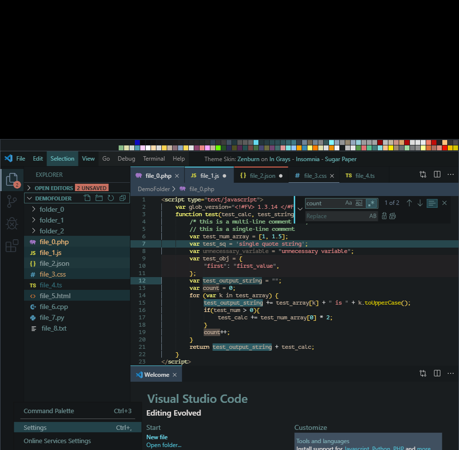</a>
</td><td colspan="2" rowspan="2" width="66%"></td></tr>
<tr><td><b>20</b> / <b>35</b> - <a href="./_gfx/zenburn-in-grays-insomnia-sugar-paper-preview.png"  title="Go to Zenburn In Grays - Insomnia - Sugar Paper">Zenburn In Grays - Insomnia - Sugar Paper</a> 
</td></tr>
</table>


### Low Blue
<div align="right">[ <a align="right" href="#table-of-contents">Table of contents</a> ]</div>

<b>2 skins</b> - Low Blue Light on UI and Token Colors

<table><tr><td> <a href="./_gfx/zenburn-in-grays-lowblue-asphalt-preview.png" title="Go to Zenburn In Grays - Low Blue - Asphalt"></a>
</td><td> <a href="./_gfx/zenburn-in-grays-lowblue-lazy-preview.png" title="Go to Zenburn In Grays - Low Blue - Lazy">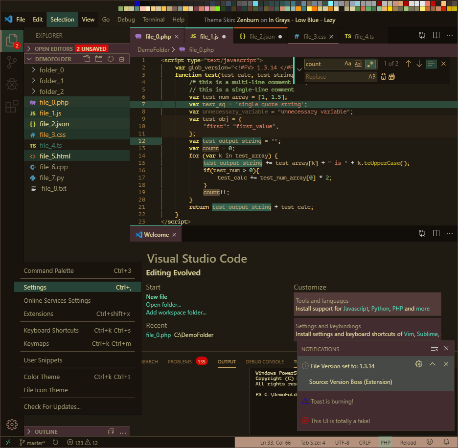</a>
</td><td colspan="1" rowspan="2" width="33%"></td></tr>
<tr><td><b>21</b> / <b>35</b> - <a href="./_gfx/zenburn-in-grays-lowblue-asphalt-preview.png"  title="Go to Zenburn In Grays - Low Blue - Asphalt">Zenburn In Grays - Low Blue - Asphalt</a> 
</td><td><b>22</b> / <b>35</b> - <a href="./_gfx/zenburn-in-grays-lowblue-lazy-preview.png"  title="Go to Zenburn In Grays - Low Blue - Lazy">Zenburn In Grays - Low Blue - Lazy</a> 
</td></tr>
</table>


### Midnight
<div align="right">[ <a align="right" href="#table-of-contents">Table of contents</a> ]</div>

<b>1 skins</b> - Midnight Blue Background, inspired by *Telegram X Midnight Theme* and Cold, Desatured Token Colors

<table><tr><td> <a href="./_gfx/zenburn-in-grays-midnight-sugar-paper-preview.png" title="Go to Zenburn In Grays - Midnight - Sugar Paper">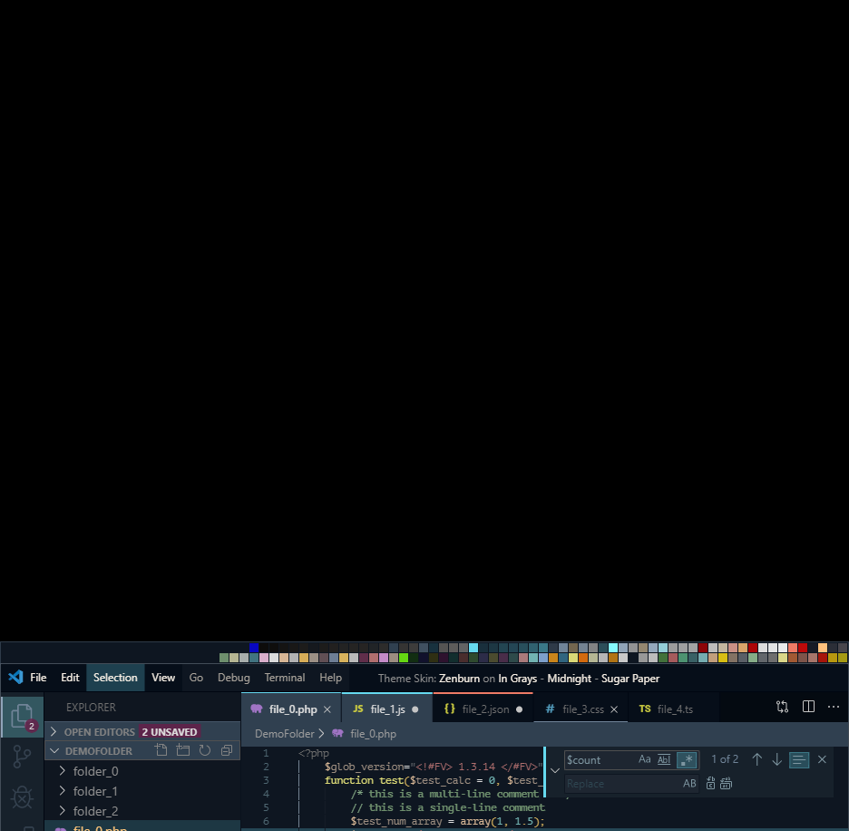</a>
</td><td colspan="2" rowspan="2" width="66%"></td></tr>
<tr><td><b>23</b> / <b>35</b> - <a href="./_gfx/zenburn-in-grays-midnight-sugar-paper-preview.png"  title="Go to Zenburn In Grays - Midnight - Sugar Paper">Zenburn In Grays - Midnight - Sugar Paper</a> 
</td></tr>
</table>


### Nadir
<div align="right">[ <a align="right" href="#table-of-contents">Table of contents</a> ]</div>

<b>4 skins</b> - Flat Grayed UI and Desatured Token Colors

<table><tr><td> <a href="./_gfx/zenburn-in-grays-nadir-asphalt-preview.png" title="Go to Zenburn In Grays - Nadir - Asphalt">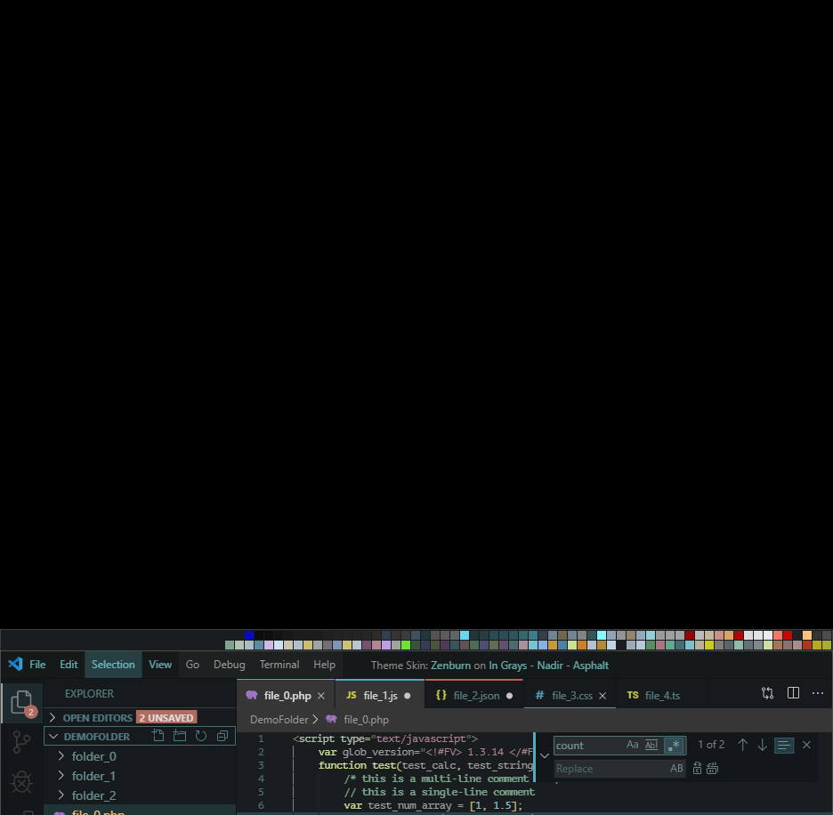</a>
</td><td> <a href="./_gfx/zenburn-in-grays-nadir-eggplant-preview.png" title="Go to Zenburn In Grays - Nadir - Eggplant">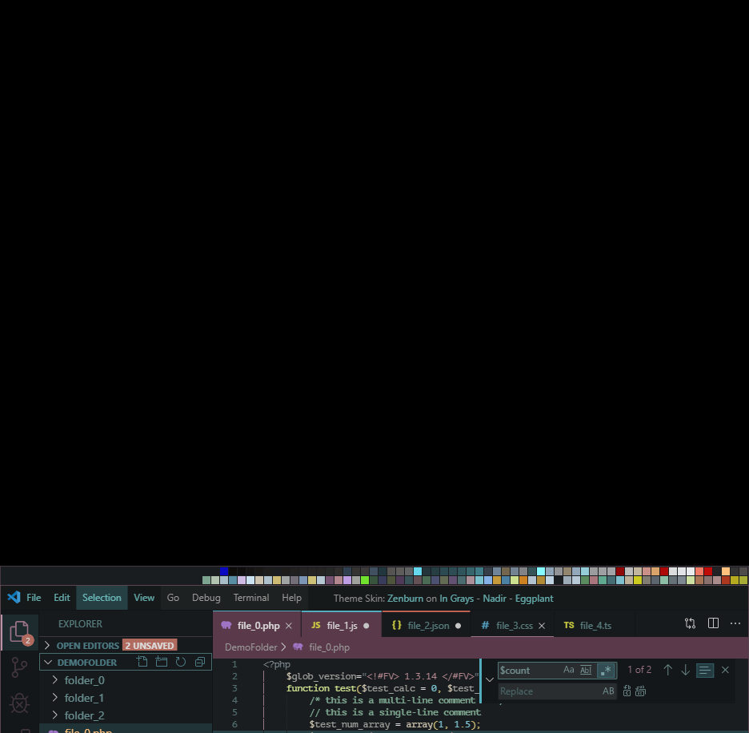</a>
</td><td> <a href="./_gfx/zenburn-in-grays-nadir-lazy-preview.png" title="Go to Zenburn In Grays - Nadir - Lazy"></a>
</td></tr>
<tr><td><b>24</b> / <b>35</b> - <a href="./_gfx/zenburn-in-grays-nadir-asphalt-preview.png"  title="Go to Zenburn In Grays - Nadir - Asphalt">Zenburn In Grays - Nadir - Asphalt</a> 
</td><td><b>25</b> / <b>35</b> - <a href="./_gfx/zenburn-in-grays-nadir-eggplant-preview.png"  title="Go to Zenburn In Grays - Nadir - Eggplant">Zenburn In Grays - Nadir - Eggplant</a> 
</td><td><b>26</b> / <b>35</b> - <a href="./_gfx/zenburn-in-grays-nadir-lazy-preview.png"  title="Go to Zenburn In Grays - Nadir - Lazy">Zenburn In Grays - Nadir - Lazy</a> 
</td></tr>
<tr><td> <a href="./_gfx/zenburn-in-grays-nadir-sugar-paper-preview.png" title="Go to Zenburn In Grays - Nadir - Sugar Paper"></a>
</td><td colspan="2" rowspan="2" width="66%"></td></tr>
<tr><td><b>27</b> / <b>35</b> - <a href="./_gfx/zenburn-in-grays-nadir-sugar-paper-preview.png"  title="Go to Zenburn In Grays - Nadir - Sugar Paper">Zenburn In Grays - Nadir - Sugar Paper</a> 
</td></tr>
</table>


### Nirvana
<div align="right">[ <a align="right" href="#table-of-contents">Table of contents</a> ]</div>

<b>4 skins</b> - Low Blue Light only on Token Colors

<table><tr><td> <a href="./_gfx/zenburn-in-grays-nirvana-asphalt-preview.png" title="Go to Zenburn In Grays - Nirvana - Asphalt"></a>
</td><td> <a href="./_gfx/zenburn-in-grays-nirvana-eggplant-preview.png" title="Go to Zenburn In Grays - Nirvana - Eggplant"></a>
</td><td> <a href="./_gfx/zenburn-in-grays-nirvana-lazy-preview.png" title="Go to Zenburn In Grays - Nirvana - Lazy"></a>
</td></tr>
<tr><td><b>28</b> / <b>35</b> - <a href="./_gfx/zenburn-in-grays-nirvana-asphalt-preview.png"  title="Go to Zenburn In Grays - Nirvana - Asphalt">Zenburn In Grays - Nirvana - Asphalt</a> 
</td><td><b>29</b> / <b>35</b> - <a href="./_gfx/zenburn-in-grays-nirvana-eggplant-preview.png"  title="Go to Zenburn In Grays - Nirvana - Eggplant">Zenburn In Grays - Nirvana - Eggplant</a> 
</td><td><b>30</b> / <b>35</b> - <a href="./_gfx/zenburn-in-grays-nirvana-lazy-preview.png"  title="Go to Zenburn In Grays - Nirvana - Lazy">Zenburn In Grays - Nirvana - Lazy</a> 
</td></tr>
<tr><td> <a href="./_gfx/zenburn-in-grays-nirvana-sugar-paper-preview.png" title="Go to Zenburn In Grays - Nirvana - Sugar Paper"></a>
</td><td colspan="2" rowspan="2" width="66%"></td></tr>
<tr><td><b>31</b> / <b>35</b> - <a href="./_gfx/zenburn-in-grays-nirvana-sugar-paper-preview.png"  title="Go to Zenburn In Grays - Nirvana - Sugar Paper">Zenburn In Grays - Nirvana - Sugar Paper</a> 
</td></tr>
</table>


### Warm
<div align="right">[ <a align="right" href="#table-of-contents">Table of contents</a> ]</div>

<b>4 skins</b> - Warm Gray Background and Warm Token Colors

<table><tr><td> <a href="./_gfx/zenburn-in-grays-warm-asphalt-preview.png" title="Go to Zenburn In Grays - Warm - Asphalt"></a>
</td><td> <a href="./_gfx/zenburn-in-grays-warm-eggplant-preview.png" title="Go to Zenburn In Grays - Warm - Eggplant"></a>
</td><td> <a href="./_gfx/zenburn-in-grays-warm-lazy-preview.png" title="Go to Zenburn In Grays - Warm - Lazy"></a>
</td></tr>
<tr><td><b>32</b> / <b>35</b> - <a href="./_gfx/zenburn-in-grays-warm-asphalt-preview.png"  title="Go to Zenburn In Grays - Warm - Asphalt">Zenburn In Grays - Warm - Asphalt</a> 
</td><td><b>33</b> / <b>35</b> - <a href="./_gfx/zenburn-in-grays-warm-eggplant-preview.png"  title="Go to Zenburn In Grays - Warm - Eggplant">Zenburn In Grays - Warm - Eggplant</a> 
</td><td><b>34</b> / <b>35</b> - <a href="./_gfx/zenburn-in-grays-warm-lazy-preview.png"  title="Go to Zenburn In Grays - Warm - Lazy">Zenburn In Grays - Warm - Lazy</a> 
</td></tr>
<tr><td> <a href="./_gfx/zenburn-in-grays-warm-sugar-paper-preview.png" title="Go to Zenburn In Grays - Warm - Sugar Paper"></a>
</td><td colspan="2" rowspan="2" width="66%"></td></tr>
<tr><td><b>35</b> / <b>35</b> - <a href="./_gfx/zenburn-in-grays-warm-sugar-paper-preview.png"  title="Go to Zenburn In Grays - Warm - Sugar Paper">Zenburn In Grays - Warm - Sugar Paper</a> 
</td></tr>
</table>


# All my Themes
<div align="right">[ <a align="right" href="#table-of-contents">Table of contents</a> ]</div>


[All my Themes on Marketplace](https://marketplace.visualstudio.com/search?term=publisher%3A%22Nicola%20Granata%22&target=VSCode&category=Themes&sortBy=Relevance).

- `Zenburn In Grays`
- [Zenburn Dark Matter](https://marketplace.visualstudio.com/items?itemName=nicola-granata.zenburn-dark-matter)


# About Themes
<div align="right">[ <a align="right" href="#table-of-contents">Table of contents</a> ]</div>


## Zenburn Themes
<div align="right">[ <a align="right" href="#table-of-contents">Table of contents</a> ]</div>


**Zenburn** variants derives from the combination of Eclipse `Zenburn Theme` and Eclipse `DevStyle` Extension.
These variants has a dark gray cold/flat/warm backgrounds (based on the theme you installed), desaturated token colors (for code) and experimental **Nirvana** (Low Blue Light only on token colors) and **Low Blue** (applied to all main set of skins and token colors) with some exceptions:

- some icons cannot seems to be filtered;
- images in extensions README.md and in image viewer cannot be filtered.

# About my PHP Script "VSCode Themes Master"
<div align="right">[ <a align="right" href="#table-of-contents">Table of contents</a> ]</div>


The `Zenburn Cold Gray` prototype was initially a manual editing of the VSCode settings and some tokens, based on the `Zenburn` theme porting from `Eclipse IDE` (see below the thanks, to the paragraph `Gratitude`) in conjunction with the background of the `DevStyle` extension for Eclipse IDE.

Realizing that, to optimize some aspects of the theme, I would have had to evaluate an infinite series of colors, I decided that I would have done first to build mathematical functions for optimizing and correcting saturation / brightness / color / transparency / contrast of configurations already consolidated.

Specifically, I created _VSCode Themes Master_ in PHP (localhost script, not distributed) that allows you to set the basic colors of the skin, on which they are calculated, with a parametric and configurable reference system for each variant, all the others interface colors, applying, at the same time, tonal variations both on the interface and on the colors of the tokens.

My personal need to optimize the colors of the VScode interface to make it uniform to the _Eclipse IDE_ interface (_Zenburn_ + _DevStyle_), has led me to notice that, despite almost all my monitors are from the same manufacturer and despite having selected the temperature color on the `sRGB` standard (which therefore has brightness, contrast and range set to specific values), the visual impact, on the same theme variant, is different: more saturated and warm on some and more cold and desaturated on others .

_VSCode Themes Master_ allows me to build all the files necessary for the publication of the theme and, for this reason, it was easy (but not so easy) for me to test and distribute single themes with many color variations of the UI and tonal variations of the tokens for the code, to try to standardize the display between monitors with "different" `sRGB` representations (for example: using a cold theme on monitors with a tendency to warm colors and vice versa, or a flat theme that, in some cases, seems to be the correct compromise between extremes).

Starting from _VSCode Themes Master_ V. 1.2.40, i can make themes, based on my skins, starting from token colors export, in JSON format,  directly from Visual Studio Code theme, not only from Textmate original themes.


# Gratitude
<div align="right">[ <a align="right" href="#table-of-contents">Table of contents</a> ]</div>


## Zenburn Token Colors based Themes
<div align="right">[ <a align="right" href="#table-of-contents">Table of contents</a> ]</div>


Many thanks to **Ryan Olson** and [Zenburn](http://kippura.org/zenburnpage/) . You can download the original porting by **Ryan Olson**, on which the first version of this variant's Token Colors were based, at Marketplace: [Zenburn Theme by Ryan Olson](https://marketplace.visualstudio.com/items?itemName=ryanolsonx.zenburn).


# License
<div align="right">[ <a align="right" href="#table-of-contents">Table of contents</a> ]</div>


MIT
